 # Rodzaje uczenia maszynowego

Podziały ze względu na:

* nadzór:
  * **uczenie nadzorowane** - trzeba etykietować zbiór uczący
  * **uczenie nienadzorowane** - nie trzeba etykietować zbioru uczącego (uczenie bez nauczyciela)
  * **częściowo nadzorowane** - część danych jest etykietowana, część nie
  * **uczenie przez wzmacnianie** - polega na dawaniu kar i nagród za konkretne wybory, które algorytm uwzględnia przy kolejnych próbach 
* sposób uogólnienia:
  * **instancje (np. KNN, drzewa)** - uczenie na pamięć, szuka najbardziej podobnego do pytanego obiektu i podpisuje go tak samo według poznanych zasad, przykład: K-nearest neighbors; przede wszystkim wielkość modelu jest nieznana przed rozpoczęciem uczenia
  * **model (np. sieci neuronowe, regresja logistyczna, SVM)** - szuka zależności między wartościami i na ich podstawie dobiera parametry funkcji, na podstawie której potem przewiduje wartość; wielkość modelu jest znana przed rozpoczęciem uczenia
* dostęp do danych:
  * **batch** - posiadamy dostęp do kompletnego zbioru danych, jeśli możemy trzymać cały zbiór danych i dane nie zmieniają się zbyt często
  * **online (mini-batches)** - karmimy model ciągle małymi porcjami danych, jeśli nie mamy miejsca na utrzymanie całego zbioru lub dane ciągle się zmieniają

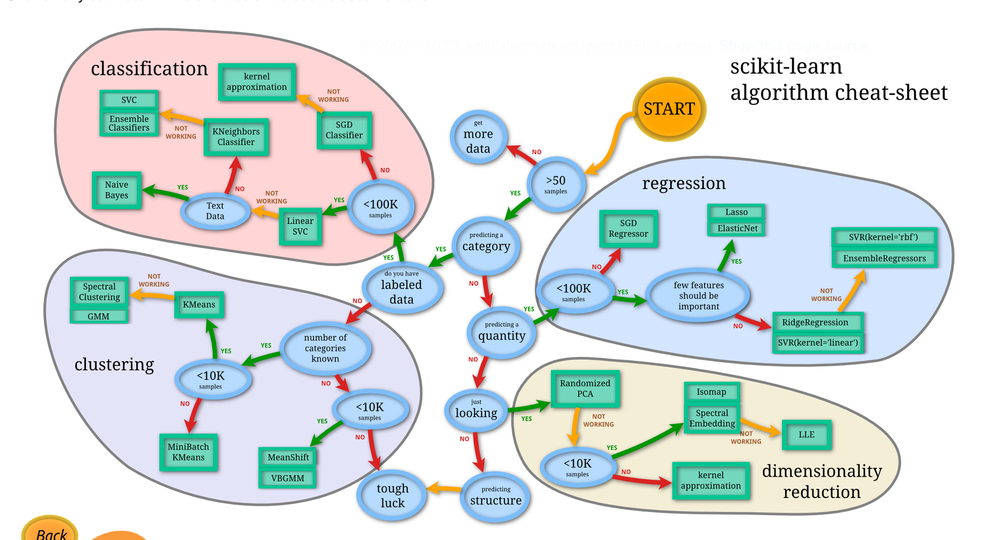

# Metryki

## ***Klasyfikacja***

* Confusion Matrix 


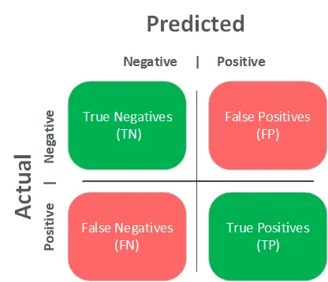{ width=60% }

    
    
### Accuracy

$$ Accuracy = \frac{TP + TN}{TP + TN + FP + FN} $$

* Classification Error
  * Wyraża jaka część instancji została dobrze sklasyfikowana

### Precision

$$ Precission = \frac{TP}{TP + FP} $$


* Stosowana gdy wymagamy od modelu wysoką wartość *True Positives* i chcemy zminimalizować liczbę *False Positives*
* Proporcja *True Positives* do *sumy True Positives i False Positives* 

### Recall (True Positive Rate, Sensitivity, Probability of Detection)

$$ Recall = \frac{TP}{TP + FN} $$

* Stosowana gdy wymagamy od modelu wysoką wartość *True Positives* i chcemy zminimalizować liczbę *False Negatives*
* Proporcja *True Positives* do *sumy True Positives i False Negatives*

### F1-score

$$ F1-score = \frac{2}{\frac{1}{Precision} + \frac{1}{Recall}} $$

* Metryka stosowana do porównywania modeli.
* Korzystne dla modeli z podobną wartością *Precision* i *Recall*.
* Średnia harmoniczna obu wartości.

### Kompromis Precision/Recall 

* *Precision* zmniejsza *Recall* i vice versa.
  
## ***Regresja***

Mean square error (błąd średnio kwadratowy):

$$ MSE(x, y) = \frac{1}{n} \sum_{i=1}^{n}{(f(x_{i}) - y_{i})^2} $$

* Błąd średnio-kwadratowy, najczęściej stosowany w przypadku regresji liniowej
* Stosowana ogólnie w regresjach
* Gdy funkcja f jest różniczkowalna, to MSE jest różniczkowalny ze względu na parametry funkcji f
* Równoważna z normą $l_2$ (Norma Euklidesowa)

Mean absolute error (błąd średnio bezwzględny):

$$ MAE(x, y) = \frac{1}{n} \sum_{i=1}^{n}{|f(x_{i}) - y_{i}|} $$

* Błąd średniego odchylenia wartości bezwzględnej
* Stosowana ogólnie w regres
* Stosowane gdy jest dużo *outlier'ów* w zbiorze
* Równoważna z normą $l_1$ (Norma Manhattan) 

Entropia:

$$ H(X) = -\sum_{i=1}^{n}{p(x_{i}) \log{p(x_{i})}} $$

* Wyraża ilość informacji, którą możemy uzyskać po otrzymaniu instancji ze zbioru
* Tworzy zbilansowane drzewa
* Tak dzielimy zbiór tworząc drzewa, aby zysk entropii był jak największy (dowiadujemy się najwięcej dzieląc w ten sposób)

* Entropy is a measure of the disorder or uncertainty in a set of data points. In the context of machine learning, it is used to quantify how mixed or diverse the classes or categories are in a dataset.  
* Entropy is calculated using the probabilities of different classes present in the dataset. If all the data points belong to the same class, the entropy is low (minimum entropy), indicating a high level of purity. On the other hand, if the data points are evenly distributed across multiple classes, the entropy is high (maximum entropy), indicating a low level of purity.


Gini:

$$ Gini(X) = 1 -\sum_{i=1}^{n}{p(x_{i})^2} $$

* Wyraża czystość zbioru
* Szybsza do obliczenia (względem entropii, nie trzeba liczyć logarytmu)
* Ma tendencję do izolowania najczęściej występującej klasy w osobnej gałęzi drzewa. 
* Jest zerowa gdy wszystkie instancje w zbiorze są tej samej klasy
* Jest maksymalna gdy instancje są równomiernie rozłożone po klasach
* Wykorzystywana w algorytmie *CART* (Classification and Regression Tree).

* The Gini index, also known as Gini impurity, is another measure of impurity or disorder in a dataset. It quantifies the probability of incorrectly classifying a randomly selected data point's label or category.   
* The Gini index ranges from 0 to 1, where 0 represents perfect purity (all data points belong to a single class) and 1 represents maximum impurity (data points are evenly distributed across all classes). The Gini index is calculated by summing up the squared probabilities of each class's occurrence and subtracting the sum from 1.

Entropia krzyżowa:

$$ H(p, q) = -\sum_{i=1}^{n}{p(x_{i}) \log{q(x_{i})}} $$

* Stosowana w klasyfikacji
* Wyraża oczekiwaną ilość informacji o instancji, jeżeli zakodujemy ją przy użyciu modelu $q$ zamiast $p$
* $p(x_{i})$ - prawdziwy rozkład prawdopodobieństwa
* $q(x_{i})$ - rozkład prawdopodobieństwa przewidywany przez model
* Podczas uczenia modelu $q$ staramy się minimalizować entropię krzyżową, ponieważ to oznacza, że potrzebujemy mniejszej liczby bitów, żeby przewidzieć klasę instancji z rozkładu $p$ (dla rozkładu $p$ podczas uczenia zazwyczaj dokładnie znamy klasy każdej z instancji, więc entropia rozkładu $p$ jest równa 0).
*  measures the difference or "distance" between the predicted probability distribution and the actual distribution of classes or categories.
* imagine you have a model that predicts the likelihood of different outcomes. Cross-entropy quantifies how well the model's predictions match the actual observations. It calculates a numerical value that represents the average amount of information or surprise needed to describe the true outcome based on the predicted probabilities

# Regresja

## Regresja Liniowa

* Opiera się na założeniu, że istnieje liniowa zależność między zmiennymi wejściowymi a zmienną wyjściową.
* Dopasowuje hiperpłaszczyznę (określoną funkcją $g$), dla której średnia odległość instancji od wartości funkcji $g$ jest najmniejsza.
* Mamy zbiór wektorów $A \subseteq \mathbb{R^{n + 1}}$ i funkcję $f: A \rightarrow \mathbb{R}$, która przyporządkowuje każdemu wektorowi $x \in A$ wartość $f(x)$
* Każdy wektor ze zbioru $A$ ma postać $x = [x_0, x_1, ..., x_n]$, gdzie $x_0 = 1$
* Chcemy znaleźć funkcję $g: \mathbb{R}^{n + 1} \rightarrow \mathbb{R}$ taką, że $g(x)=\Theta^Tx$ dla pewnego wektora $\Theta \in \mathbb{R}^n$ i wektor $\Theta$ minimalizuje $MSE(x, \Theta) = \frac{1}{n} \sum_{i=1}^{n}{(\Theta^Tx - f(x))^2}$
* Można pokazać, że jeżeli mamy wektor $z$ wszystkich wartości $f(x)$ dla wszystkich wektorów ze zbioru $A$ oraz $X$ jest macierzą złożoną ze wszystkich wektorów z A, to $\Theta=(X^TX)^{-1}X^T$
* used to model the relationship between a dependent variable (target variable) and one or more independent variables (features)
* aims to find the best-fitting line that minimizes the difference between the predicted and actual values

```python
from sklearn.linear_model import LinearRegression
import numpy as np

# Generate sample data
X = np.array([[1], [2], [3], [4], [5]])  # Independent variable (feature)
y = np.array([2, 4, 6, 8, 10])           # Dependent variable (target)

# Create and fit the linear regression model
model = LinearRegression()
model.fit(X, y)

# Make predictions
new_X = np.array([[6], [7]])  # New data points for prediction
predictions = model.predict(new_X)

print(predictions)
```

## Gradient Descent

* Stosowany jeżeli nie można znaleźć rozwiązania analitycznego (np. w przypadku regresji logistycznej), a rozważana funkcja jest ciągła i różniczkowalna w rozważanej dziedzinie
* Zaczynamy ze startowym wektorem x z dziedziny analizowanej funkcji
* Obliczamy gradient funkcji w punkcie x
* Przesuwamy się w kierunku przeciwnym do wektora gradientu, ponieważ gwarantuje to najszybsze możliwe zmniejszanie się wartości funkcji
* Znajduje minimum lokalne.
* process of finding the best fit for a model by adjusting its parameters in small steps. 
* The algorithm starts with an initial set of parameter values and calculates the gradient (or slope) of the function at that point. 
* The gradient tells us the direction of steepest increase in the function. By taking steps in the opposite direction of the gradient, we gradually move towards the minimum of the function.
```python
from sklearn.linear_model import LinearRegression
import numpy as np

# Generate sample data
X = np.array([[1], [2], [3], [4], [5]])  # Independent variable (feature)
y = np.array([2, 4, 6, 8, 10])           # Dependent variable (target)

# Create and fit the LinearRegression model using gradient descent
model = LinearRegression()
model.fit(X, y)

# Access the model's parameters
intercept = model.intercept_
slope = model.coef_

print(intercept, slope)
```

## Stochastic Gradient Descent:

* Stosowany w przypadku, gdy zbiór danych jest bardzo duży
* Do obliczania gradientu wybieramy losowo podzbiór danych
* Znajduje minimum lokalne, szybciej niż *Gradient Descent*, ale nie jest tak dokładny.
*  particularly effective when dealing with large datasets as it processes the data one sample at a time or in small batches instead of the entire dataset
*  SGD is like a faster but more noisy version of gradient descent
* Instead of calculating the gradient of the loss function over the entire dataset, SGD calculates the gradient for each training sample or batch and updates the model's parameters accordingly. This process is repeated for multiple iterations until the model converges to the optimal parameters.

```python
from sklearn.linear_model import SGDRegressor
import numpy as np

# Generate sample data
X = np.array([[1], [2], [3], [4], [5]])  # Independent variable (feature)
y = np.array([2, 4, 6, 8, 10])           # Dependent variable (target)

# Create and fit the SGDRegressor model using stochastic gradient descent
model = SGDRegressor(learning_rate='constant', eta0=0.01, max_iter=1000)
model.fit(X, y)

# Make predictions
new_X = np.array([[6], [7]])  # New data points for prediction
predictions = model.predict(new_X)

print(predictions)
```

## Regresja wielomianowa

* Regresja liniowa, ale zamiast liniowej funkcji $g$ używamy wielomianu $g$ stopnia $n$
* Do każdej instancji $x$ dodajemy nowe cechy $x_2 = x^2, x_3 = x^3, ..., x_n = x^n$, następnie stosujemy regresję liniową na nowym zbiorze cech.
* polynomial regression fits a curve to the data instead of a straight line. This curve can be adjusted to better capture the underlying patterns in the data and make more accurate predictions
```python
import numpy as np
from sklearn.linear_model import LinearRegression
from sklearn.preprocessing import PolynomialFeatures
import matplotlib.pyplot as plt

# Sample data
x = np.array([1, 2, 3, 4, 5])
y = np.array([1, 3, 2, 5, 4])

# Transforming the data to include polynomial terms up to degree 2
poly_features = PolynomialFeatures(degree=2)
X_poly = poly_features.fit_transform(x.reshape(-1, 1))

# Fitting the polynomial regression model
model = LinearRegression()
model.fit(X_poly, y)

# Predicting for new data
x_new = np.array([6, 7, 8])
X_new_poly = poly_features.transform(x_new.reshape(-1, 1))
y_new = model.predict(X_new_poly)

# Plotting the results
plt.scatter(x, y, color='blue', label='Actual')
plt.plot(x_new, y_new, color='red', label='Predicted')
plt.xlabel('x')
plt.ylabel('y')
plt.legend()
plt.show()

```

## Learning Curves

### Bias

* Błąd generalizacji wynikający ze złych założeń. Prowadzi do *underfittingu*
* Model jest najprawodopodobniej zbyt prosty.

### Variance

* Nadmierna wrażliwość na małą wariancję w zbiorze danych. Prowadzi do *overfittingu*
* Model jest najprawodopodobniej zbyt skomplikowany.

### Irreducible Error

* Wynika z zaszumionego zbioru danych.
  
### Kompromis między *Bias* a *Variance*

* Zwiększenie złożoności modelu prowadzi do zwiększenia *Variance* i zmniejszenia *Bias'u* i vice versa.

---

## Regularyzowane modele liniowe

### Ridge Regression

* Regularyzowana wersja *Regresji Liniowej*
* Zmusza model do utrzymywania małych wag
* Używa normy $l_2$
* ridge regression adds a penalty term to the OLS objective function, which helps prevent overfitting and improves the stability of the model. This penalty term, known as the ridge parameter or alpha, controls the amount of shrinkage applied to the coefficients. 
* By shrinking the coefficients towards zero, ridge regression reduces their variance and makes the model less sensitive to small changes in the input data.

```python
from sklearn.linear_model import Ridge
from sklearn.model_selection import train_test_split
from sklearn.metrics import mean_squared_error
import numpy as np

# Generate some random data
np.random.seed(1)
X = np.random.rand(100, 5)  # Features
y = np.random.rand(100)     # Target variable

# Split the data into training and test sets
X_train, X_test, y_train, y_test = train_test_split(X, y, test_size=0.2)

# Create a ridge regression model
ridge = Ridge(alpha=0.5)  # alpha controls the strength of regularization

# Fit the model on the training data
ridge.fit(X_train, y_train)

# Predict on the test data
y_pred = ridge.predict(X_test)

# Calculate the mean squared error
mse = mean_squared_error(y_test, y_pred)

print("Mean Squared Error:", mse)
```

### Lasso Regression

* Regularyzowana wersja *Regresji Liniowej*
* Używa normy $l_1$
* Ma tendencje do usuwania wag dla najmniej ważnych cech
* Zwraca *Rzadki model* (Dużo zer w polach wag)
* lasso regression helps identify the most important features and removes the irrelevant or redundant ones. 
* It achieves this by adding the absolute values of the coefficients as a penalty term to the OLS objective function. This penalty term, controlled by the lasso parameter or alpha, promotes sparsity and encourages the model to select only the most informative features while shrinking the coefficients towards zero.

```python
from sklearn.linear_model import Lasso
from sklearn.model_selection import train_test_split
from sklearn.metrics import mean_squared_error
import numpy as np

# Generate some random data
np.random.seed(1)
X = np.random.rand(100, 5)  # Features
y = 3 * X[:, 0] + 2 * X[:, 1] - 5 * X[:, 2] + np.random.randn(100)  # Target variable

# Split the data into training and test sets
X_train, X_test, y_train, y_test = train_test_split(X, y, test_size=0.2)

# Create a lasso regression model
lasso = Lasso(alpha=0.1)  # alpha controls the strength of regularization

# Fit the model on the training data
lasso.fit(X_train, y_train)

# Predict on the test data
y_pred = lasso.predict(X_test)

# Calculate the mean squared error
mse = mean_squared_error(y_test, y_pred)

print("Mean Squared Error:", mse)
```
### Early Stopping

* Zatrzymuje proces uczenia w momencie gdy *błąd walidacji* osiąga minimum.

---

## Regresja Logistyczna
* Wykorzystuj funkcję aktywacji $f(x) = \frac{1}{1+e^{-x}}$ (Sigmoid)
* Szacuje prawdopodobieństwo przynależności instancji do pewnej klasy.
* Stosuje funkcji *sigmoid* do zwrócenia prawdopodobieństwa (Sigmoid zwraca wartości między 0 a 1).
* Logistic regression is a type of statistical analysis that is used to predict the probability of a binary outcome (e.g., yes or no, true or false) based on input variables. It's called "logistic" because it uses the logistic function, which maps any real-valued number to a value between 0 and 1.

* To understand logistic regression, let's imagine we want to predict whether an email is spam or not based on certain characteristics of the email, such as the length of the email, the presence of certain keywords, or the number of exclamation marks.  
In logistic regression, we start by collecting a dataset of labeled emails, where each email has features (e.g., length, keywords, exclamation marks) and a corresponding label indicating whether it's spam or not. We then use this dataset to train a logistic regression model.  
During the training process, the logistic regression model learns the relationship between the features and the probability of an email being spam. It calculates the weighted sum of the input features and applies the logistic function to this sum. The logistic function converts the sum to a value between 0 and 1, which represents the predicted probability of the email being spam.
* Once the model is trained, we can use it to predict the probability of new, unseen emails being spam. We provide the features of the new email to the trained model, and it calculates the probability using the learned weights and the logistic function. If the predicted probability is above a certain threshold (e.g., 0.5), we classify the email as spam; otherwise, we classify it as not spam.

* Logistic regression is a popular and interpretable method for binary classification tasks. It's widely used in various domains, including spam detection, disease diagnosis, and credit scoring, where we need to predict the likelihood of a particular outcome.


# SVM (Support Vector Machines)

* Algorytm klasyfikacji oparty o zasadę największego marginesu. 
  
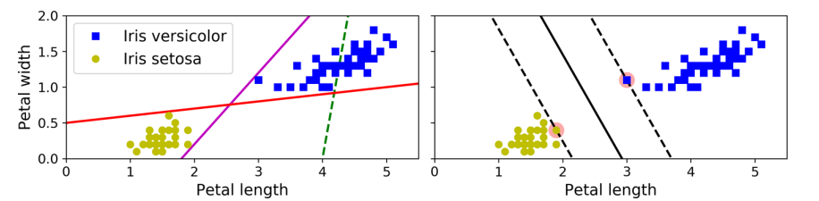  

* Wrażliwy na skalowanie danych (Zawsze skalować przed użyciem)
* Support Vector Machines (SVM) is a machine learning algorithm used for both classification and regression tasks. In simple words, SVM finds a way to draw a line or boundary that separates different classes of data points.

Imagine you have a dataset with two different classes of points, and you want to find a line that can best separate them. The SVM algorithm helps you with that.

Here's how SVM works:

SVM starts by plotting all the data points on a graph, where each point represents an example or instance from your dataset.
It tries to find the best line, called a "decision boundary," that separates the two classes as clearly as possible.
The decision boundary is constructed in such a way that it maximizes the distance between the boundary and the nearest data points of each class. These nearest data points are known as "support vectors," which is why the algorithm is called Support Vector Machines.
Once the decision boundary is established, you can use it to classify new, unseen data points. You simply check which side of the boundary the point falls on, and assign it to the corresponding class.
SVM is powerful because it can handle complex datasets and works well even when the classes are not linearly separable (i.e., they cannot be separated by a straight line). SVM achieves this by using a technique called the "kernel trick." The kernel trick allows SVM to transform the data into a higher-dimensional space where the classes can be linearly separable, even if they were not in the original space.

In summary, SVM is an algorithm that finds the best line or boundary to separate different classes of data points. It is widely used for classification tasks, especially when the classes are not easily separable. SVM is effective and flexible due to its ability to use the kernel trick to handle complex datasets.

```python
from sklearn import svm
from sklearn.datasets import make_classification
from sklearn.model_selection import train_test_split
from sklearn.metrics import accuracy_score

# Generate a synthetic dataset for demonstration
X, y = make_classification(n_samples=100, n_features=2, n_informative=2, n_redundant=0, random_state=42)

# Split the dataset into training and testing sets
X_train, X_test, y_train, y_test = train_test_split(X, y, test_size=0.2, random_state=42)

# Create an SVM classifier object
clf = svm.SVC(kernel='linear')

# Train the SVM classifier
clf.fit(X_train, y_train)

# Make predictions on the test set
y_pred = clf.predict(X_test)

# Calculate the accuracy of the classifier
accuracy = accuracy_score(y_test, y_pred)
print("Accuracy:", accuracy)  
```
## Hard Margin Classification

* Wszystkie instancje muszą się znaleźć poza marginesem.
* Działa tylko wtedy, gdy dane da się liniowo rozdzielić.
* Wrażliwy na *outliers'y*

## Soft Margin Classification

* Elastyczny model
* Szyka balansu między posiadaniem jak największego marginesu, a limitowaniem liczby jego naruszeń.

## Nieliniowa klasyfikacja SVM

* Używaj kiedy dane nie da się rozdzielić liniowo.

### Polynomial Kernel

* Sztuczka dzięki której możemy dostać wyniki, jakbyśmy korzystali z wielomianowego modelu bez użycia go.

## Regresor SVM

* By działał musimy odwrócić jego zadanie- zmieścić jak najwięcej instancji w jak najmniejszym marginesie.
  
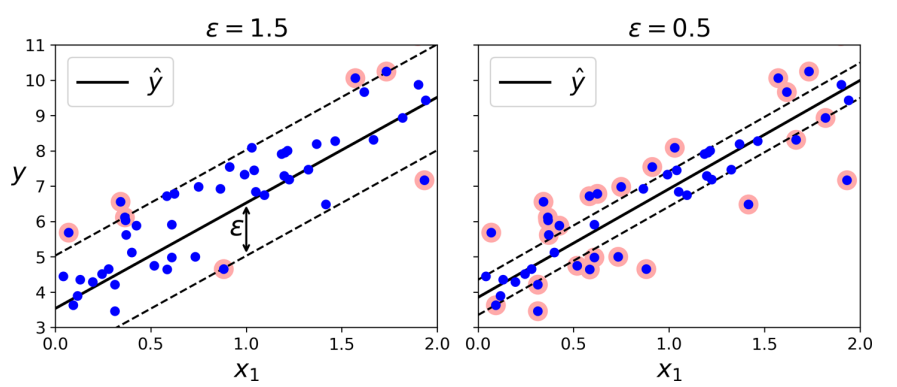

* Model jest $\epsilon$ niewrażliwy, czyli dodawanie więcej instancji znajdujących się w marginesie nie wpływa na zdolność przewidywania modelu.
* Do rozwiązywania nieliniowych modeli użyj **kernelized SVM model**


## Drzewa Decyzyjne
* The decision tree is built during a training process. It automatically determines the best questions to ask and the optimal order of the questions based on the training data. The goal is to create a tree that can make accurate predictions for new, unseen examples.

Decision trees are intuitive and easy to understand because they resemble a flowchart of logical decisions. They can handle both categorical and numerical features. Decision trees also support multi-class classification and can be used for regression tasks by predicting numerical values instead of categories.

However, decision trees can sometimes be prone to overfitting, where the model becomes too complex and fits the training data too closely, resulting in poor generalization to new data. Techniques like pruning and setting limits on tree depth can help mitigate overfitting.

Overall, decision trees provide a simple and interpretable approach to decision-making and prediction, making them a popular choice in machine learning.
* Stosowany do klasyfikacji i regresji
* Nie wymaga przygotowania danych, nie trzeba skalować ani centrować
* **Model Nieparametryczny**
  * Liczba parametrów nie jest zdefiniowana przed ćwiczeniem modelu
  * Model może się przeuczyć.
* **White Box model**
  * Prosty do zinterpretowania- wiemy dlaczego podjął taką a nie inną decyzję.
* Scikit używa algorytmu **CART** (próbuje zachłannie minimalizować współczynnik Gini) do trenowania drzew decyzyjnych
* Algorytm **CART** w celu ustalenia miejsca podziału oblicza wartość \
$J(k, t_k) = \frac{m_{lewa}}{m} * G_{lewa} + \frac{m_{prawa}}{m} * G_{prawa}$, gdzie $G_{lewa}$ i $G_{prawa}$ wyrażają nieczystości lewej i prawej części po podziale, a $m_{lewa}$ i $m_{prawa}$ to liczba instancji w lewej i prawej części, $m$ to liczba wszystkich instancji
* Obrót przestrzeni instancji może całkowicie zmieniać wygenerowane drzewo i jego złożoność.

### White Box vs Black Box

* W przypadku *Black Box* ciężko jest sprawdzić dlaczego dany model podjął taką decyzję
* Dla modeli, które nie są *White Box* bardzo trudnym zadaniem jest dokładne określenie wnioskowania przeprowadzonego przez model, które może być łatwo zrozumiane przez człowieka0
* Przykłady *White Box*:
  * Drzewa decyzyjne
  * Regresja Liniowa
  * SVM
* Przykłady *Black Box*:
  * Sieci neuronowe
  * Random Forests

### Hiperparametry

* Bez żadnych ograniczeń model bardzo szybko przeucza się (Wtedy go nazywamy nieparametrycznym, opisany wyżej)
* ***Regularyzacja*** jest procesem mającym przeciwdziałać przeuczeniu, przez dobranie odpowiednich hiperparametrów
  * Najważniejszą wartość jaką możemy dostrajać jest ograniczenie maksymalnej *głębokości drzewa* (Domyślnie jest $\infty$)

### Regresja

* Struktura drzewa przypomina tą z problemu klasyfikacji.
* Możemy uznać problem regresji jako problem klasyfikacji z nieograniczoną liczbą klas, którą możemy regulować przez maksymalną głębokość drzewa.

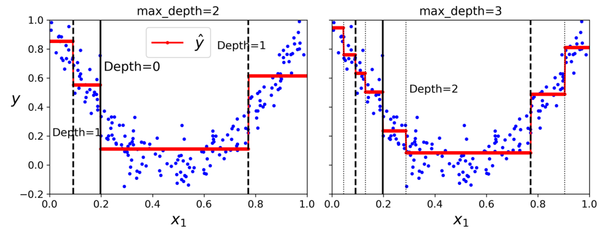

# Ensemble Learning i Random Forests
Ensemble learning is a machine learning technique that combines the predictions of multiple individual models, called "base models" or "learners," to make more accurate and robust predictions.

Think of it as a group of friends trying to solve a problem together. Each friend has their own perspective and expertise, and they contribute their opinions to reach a better solution. Similarly, ensemble learning combines the knowledge and predictions of multiple models to improve overall performance.

There are two main approaches to ensemble learning: bagging and boosting.

Bagging: In bagging, multiple base models are trained independently on different subsets of the training data. Each model learns to make predictions on its subset. The final prediction is then obtained by aggregating the predictions of all the models, such as by averaging the results (for regression) or taking a majority vote (for classification). Bagging helps reduce overfitting and improves stability by reducing the impact of individual models' errors.

Boosting: Boosting, on the other hand, focuses on sequentially improving the performance of a base model. The base model is initially trained on the entire dataset. The subsequent models are then trained to correct the mistakes made by the previous models. The final prediction is obtained by combining the weighted predictions of all the models. Boosting helps in building strong models by emphasizing the examples that are difficult to classify.

Ensemble learning can improve prediction accuracy, increase model robustness, and handle complex relationships in the data. It is widely used in various domains and machine learning algorithms, such as Random Forest (an ensemble of decision trees) and Gradient Boosting (e.g., XGBoost, AdaBoost). By leveraging the wisdom of multiple models, ensemble learning can provide more reliable and accurate predictions compared to using a single model alone.

* Stosujemy zasadę *mądrości tłumu* - jeżeli mamy wiele klasyfikatorów, to możemy je zagregować w grupę klasyfikatorów znacznie zwiększając wydajność modelu.
* Wszystkie klasyfikatory powinny być od siebie niezależne
* Redukuje *Bias* i *Variance*

## W problemie klasyfikacji rozróżniamy 2 rodzaje klasyfikatorów:

Wykorzystywana jest moc przyjaźni (ang. *Power of friendship*).

### *Hard Voting Classifier*

* Wybiera klasę, która jest dominantą zbioru propozycji klas zwróconych przez klasyfikatory.

### *Soft Voting Classifier*

* Wykorzystuje prawdopodobieństwa zwracane przez model, następnie uśrednia je i wybiera klasę z najwyższym średnim prawdopodobieństwem.

## Bagging i Pasting

* Wykorzystują wiele instancji klasyfikatora tego samego typu, ale trenowanych na różnych podzbiorach danych.

* **Bagging** (Bootstrap Aggregating) polega na losowaniu instancji ze zwracaniem (zastępowaniem) i trenowaniu na nich różnych klasyfikatorów, a następnie wykorzystaniu metody *hard voting* do wyboru klasy.
* **Pasting** jest podobny do *Bagging'u*, ale zamiast losować instancje ze zwracaniem, losuje je bez zwracania, co oznacza, że każdy klasyfikator może być trenowany tylko na części danych, a liczba klasyfikatorów jest ograniczona przez liczbę instancji w zbiorze treningowym.

## Random Forests

* Zbiór drzew decyzyjnych
* Dodaje extra losowość
* Umożliwia łatwe sprawdzenie istotności pewnej cechy
* Jeżeli zastosujemy *Bagging* na drzewach decyzyjnych, to otrzymamy *Random Forest*
* Agreguje predykcje ze wszystkich drzew i wybiera klasę o największej ilości głosów (hardvoting)
  * Grupa drzew decyzyjnych
  * Każdy uczy się na innym podzbiorze zbioru danych

```python
  from sklearn.ensemble import RandomForestClassifier
from sklearn.datasets import load_iris
from sklearn.model_selection import train_test_split
from sklearn.metrics import accuracy_score

# Load the Iris dataset
data = load_iris()
X = data.data
y = data.target

# Split the dataset into training and testing sets
X_train, X_test, y_train, y_test = train_test_split(X, y, test_size=0.2, random_state=42)

# Create a Random Forest classifier with 100 trees
rf = RandomForestClassifier(n_estimators=100)

# Train the Random Forest classifier
rf.fit(X_train, y_train)

# Make predictions on the test set
y_pred = rf.predict(X_test)

# Calculate the accuracy of the classifier
accuracy = accuracy_score(y_test, y_pred)
print("Accuracy:", accuracy)
```

### Extremely Randomized Trees Ensembly

* Szybciej się uczy
* Stosuje losowe progi dla każdej cechy
  
## Boosting
* Boosting is an ensemble learning technique that combines multiple weak or base models to create a stronger predictive model. The key idea behind boosting is to train the models sequentially, where each subsequent model focuses on correcting the mistakes made by the previous models.
* Łączy wiele *weak learners* w *strong learner*
* Trenuje predyktory sekwencyjnie
  * Każdy kolejny próbuje poprawić błędy poprzedniego

### AdaBoost
* AdaBoost starts by training a base model (e.g., a decision tree) on the training data.
* It assigns higher weights to the misclassified examples from the previous model, making them more influential for the subsequent model.
* The next model is trained on the updated weights, focusing on the previously misclassified examples.
* This process continues, with each subsequent model adjusting its focus based on the mistakes of the previous models.
* Finally, the predictions of all the models are combined using a weighted majority vote to make the final prediction.
* AdaBoost tends to give more emphasis to challenging examples, improving the overall performance of the ensemble model.
* Adaptive Boosting
* Zwraca uwagę na instancje słabo dopasowane przez poprzednie predyktory.
* Nie skaluje się dobrze.

### Gradient Boosting
* Gradient Boosting is similar to AdaBoost, but instead of adjusting the weights, it focuses on the residuals (the differences between predicted and actual values) of the previous model.
* It starts by training a base model on the training data.
* The subsequent models are trained to predict the residuals of the previous model, rather than the actual target values.
* The predictions of all the models are added together in a step-by-step manner, gradually reducing the residuals and improving the overall accuracy.
* Gradient Boosting is more flexible than AdaBoost, as it can work with different loss functions and handle various types of data (categorical, numerical, etc.).
* Możemy go użyć z różnymi funkcjami straty
* Dopasowuje nowy predyktor do pozostałego błędu przez poprzedni model
* **XGBoost**
  * Aktualnie najlepszy klasyfikator (razem z CatBoostem).


## Stacking

* Metoda podobna do *Voting Classifier'a*, ale zamiast używać prostych funkcji do agregacji predykcji, trenuje model, aby nauczył się jak łączyć predykcje innych modeli
* Możliwe jest stosowanie bardziej zagnieżdżonych architektur, w których występują kolejne warstwy modeli.

# Redukcja Wymiarów

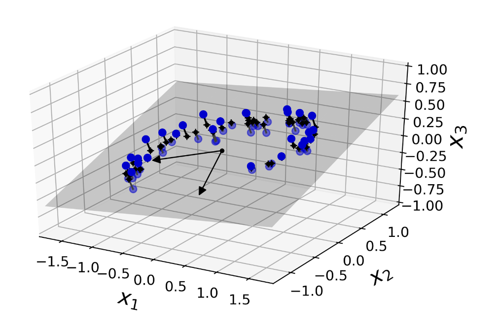

* Stosujemy do uproszczenia zbioru danych w celu przyspieszenia procesu uczenia modelu
* Prowadzi do utraty części informacji, umożliwiając jednocześnie lepszą wydajność modelu
* Może być również wykorzystywana do wizualizacji danych.

## Curse of Dimensionality

* Odnosi się do zjawiska, w którym dodanie kolejnych wymiarów do zbioru danych powoduje znaczny (eksponencjalny) wzrost wymaganej ilości danych do zachowania odpowiedniej gęstości danych.

## PCA - Principal Component Analysis

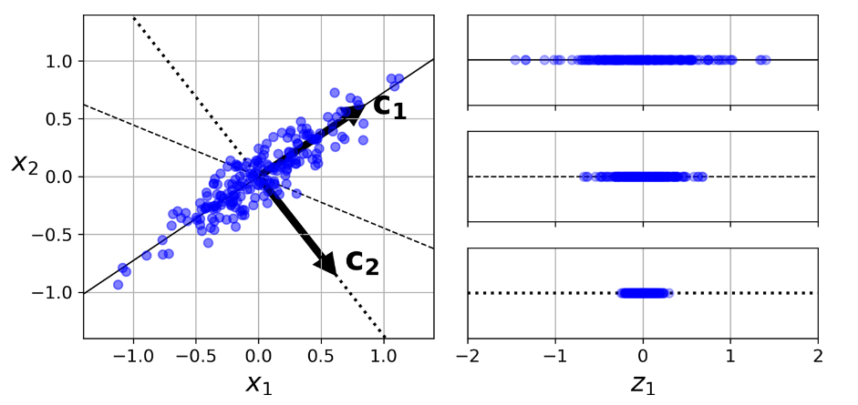

* Jest to metoda redukcji wymiarów, w której wybieramy kierunki, które zachowują najwięcej informacji
* Kierunki te są nazywane **principal components**
* PCA znajduje kierunki, które minimalizują *średnią kwadratową odległość* między punktami danych a ich rzutami na kierunki
* Staramy się znaleźć takie kierunki, dla których występuje największa wariancja danych
* Na początku standaryzujemy dane, aby średnie wartości były równe 0
* Znajdujemy bazę przestrzeni, która jest najbardziej zbliżona do danych pod względem *średniej kwadratowej odległości* dla punktów danych i ich rzutów na bazę
* Istnieje szybszy algorytm randomizowany, który znajduje przybliżone rozwiązanie.

### SVD - Singular Value Decomposition

* Jest to metoda rozkładu macierzy na iloczyn 3 macierzy
* Umożliwia wyznaczenie kierunków, które zachowują najwięcej informacji
* Stosowana w PCA
* Uogólnienie wartości własnych i wektorów własnych na macierze niekwadratowe
* Największe wartości singularne odpowiadają kierunkom, które zachowują najwięcej informacji.

## Incremental PCA 
* minibatch, out-of-core, praca na strumieniach, trzeba podać liczbę wymiarów
* Czyli w sumie po prostu PCA na online(minibatches), gdzie nie ładujemy całego zestawu danych na raz do modelu

## Rozmaitości

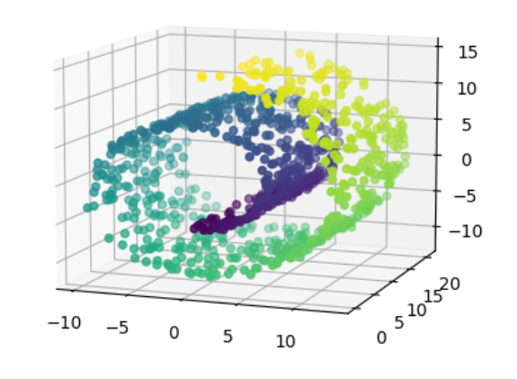

* Są to zbiory danych, które mogą być zredukowane do mniejszej liczby wymiarów, ale nie muszą być przestrzeniami liniowymi
* W małej skali wyglądają jak przestrzenie liniowe, ale w większej skali mogą mieć kształty przeróżne
* Zastosowanie dla nich algorytmu PCA może prowadzić do zbyt intensywnej utraty informacji
* Istnieją algorytmy, które pozwalają na redukcję wymiarów dla takich zbiorów danych.

### LLE - Locally Linear Embedding

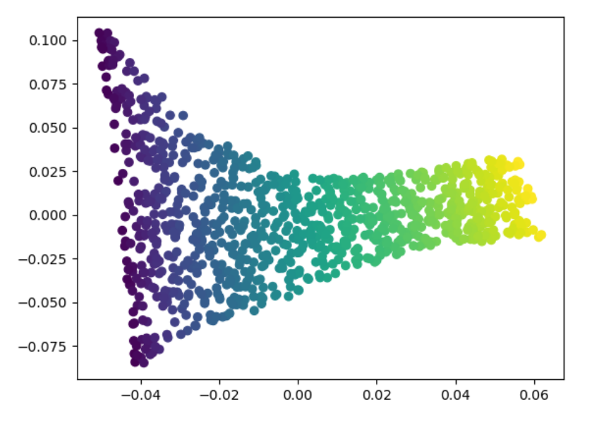

* Algorytm ten znajduje lokalne zależności między punktami danych, a następnie próbuje zachować te zależności w niższej wymiarowości
* Jest to algorytm nienadzorowany
* Może prowadzić do zniekształcenia danych w dużej skali
* W pierwszym kroku znajduje najbliższych sąsiadów dla każdego punktu danych
* Następnie znajduje wagi, które pozwalają na rekonstrukcję każdego punktu danych jako kombinacji liniowej jego najbliższych sąsiadów
* W ostatnim kroku rzutuje dane na przestrzeń o niższej wymiarowości, zachowując lokalne zależności.

# Uczenie nienadzorowane

Kategorie uczenia nienadzorowanego:

* Klasteryzacja *clustering*
  * identyfikacja klas
  * redukcja wymiarów
  * analiza danych (po klasteryzacji, dla każdej klasy osobno)
  * uczenie częściowo nadzorowane
  * segemntacja obrazu, detekcja, kompresja
* Detekcja anomalii
  * detekcja wartości odstających, *outlierów*
* Estymacja gęstości *density estimation*

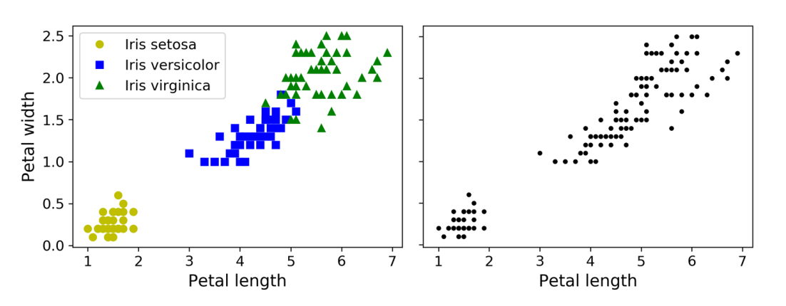

## Soft Clustering
* Przypisuje każdej instancji wynik przypisywany dla każdego klastra.
  * Wynikiem może być np. dystans pomiędzy instancją a centroidą.

## Hard Clustering
* Każda instancja jest przypisana do 1 klastra.

## Algorytm centroidów (k-średnich) *K-Means*

* Algorytm centroidów (k-średnich) *K-Means* jest jednym z najpopularniejszych algorytmów klasteryzacji.
* Algorytm stara się znaleźć środek każdego z *k* skupisk
* Algorytm ten przypisuje każdy punkt danych do najbliższego centroidu, a następnie przesuwa centroidy tak, aby minimalizować średnią kwadratową odległość między punktami danych a ich centroidami
* *k* jest parametrem algorytmu, który musi zostać określony przez użytkownika
* Jest zbieżny
* Nie gwarantuje znalezienia optimum (zależy od kroku 1)
  * Domyślnie algorytm uruchamiany jest 10 razy
  * Wybierany jest model z najmniejszą **inercją**: średnio-kwadratowa odległość między instancjami i ich centroidami
    * zmierz odległość między instancjami a ich centroidami
    * zsumuj kwadraty w/w odległości w ramach klastra
    * zsumuj wartości inercji dla wszystkich klastrów
* Przedstawieniem wyniku działania algorytmu jest Diagram Woronoja *Voronoi*
* *K-Means++*
  * Nowsza wersja
  * W bardziej optymalny sposób dobiera początkowe centroidy (probabilistycznie wybiera po oległości od pierwszego centoidu)
* *Mini batch K-Means*
  * Używa *batch* zamiast całego zbioru danych
```python
from sklearn.cluster import KMeans
import numpy as np

# Generate sample data
X = np.array([[1, 2], [1, 4], [1, 0], [4, 2], [4, 4], [4, 0]])

# Create a KMeans object and specify the number of clusters (k)
kmeans = KMeans(n_clusters=2)

# Fit the K-means model to the data
kmeans.fit(X)

# Obtain the cluster labels for each data point
labels = kmeans.labels_

# Obtain the coordinates of the cluster centers
centers = kmeans.cluster_centers_

# Print the cluster labels and centers
print("Cluster Labels:", labels)
print("Cluster Centers:", centers)

```
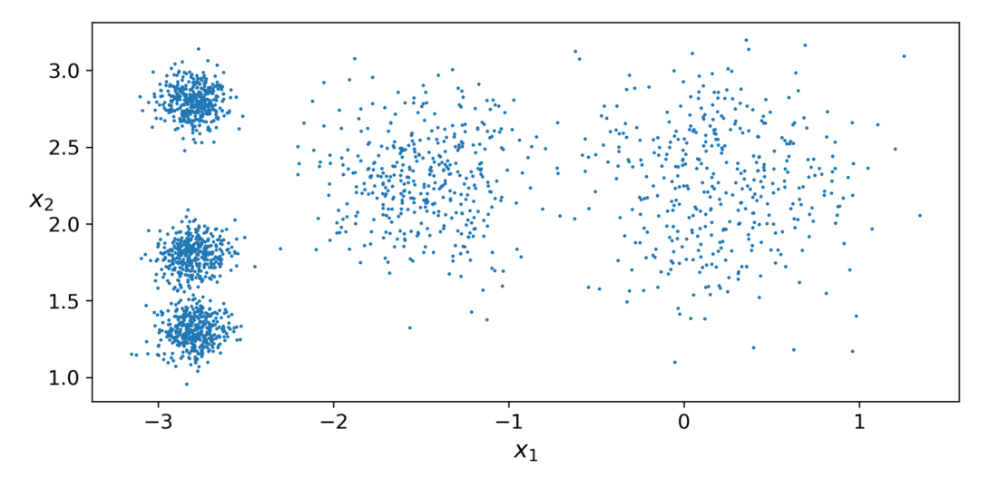

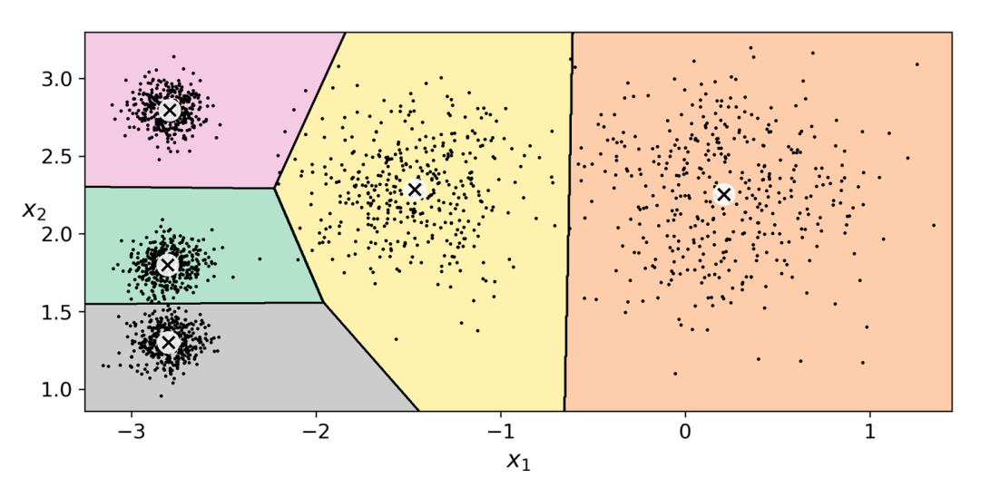

### Wyznaczanie liczby klastrów

Do wyznaczenia liczby klastrów nie wystarcza sama inercja, ponieważ maleje ona wraz ze zwiększaniem się liczby klastrów.


**Inercja** (suma kwadratów odległości od centoidu w klastrze) nie wystarcza, ale można ją wykorzystać. Wystarczy wyznaczyć inercję dla różnych wartości *k* i wybrać tę, która jest na 'zgięciu' wykresu.\

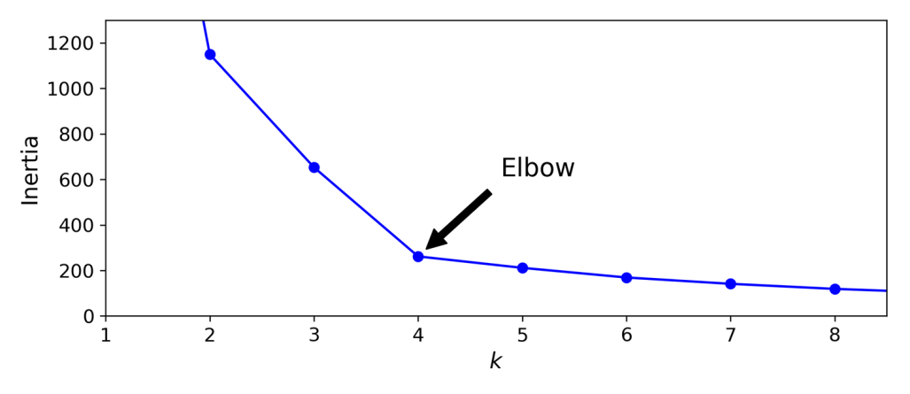

Do wyznaczenia liczby klastrów możemy również wykorzystać **Wskaźnik sylwetkowy, *silhouette score***. Wskaźnik bierze pod uwagę średnią odległość pomiędzy obserwacjami wewnątrz grupy (*a*) i średnią odległość pomiędzy obserwacjami do najbliższej "obcej" grupy (*b*) i dany jest wzorem:

$$ s = \frac{a-b}{max(a,b)} $$

* Najlepsza wartość: 1
* Najgorsza wartość: -1
* Nakładające się wartości: w pobliżu 0

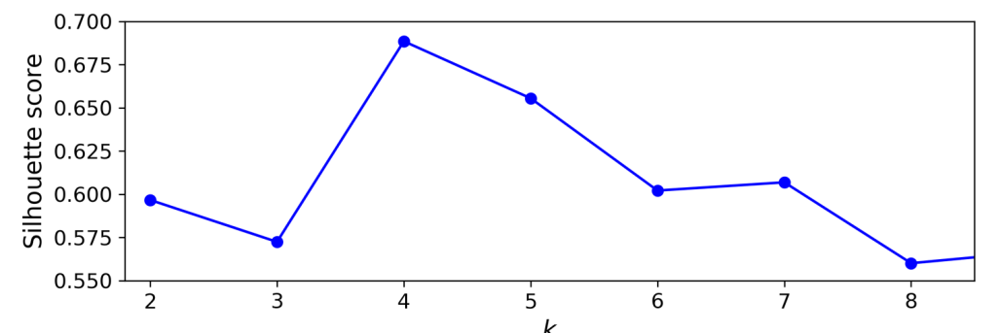

## DBSCAN

DBSCAN (Density-Based Spatial Clustering of Applications with Noise) is an algorithm used for clustering data based on the density of data points in the feature space. It is particularly useful for identifying clusters of varying shapes and handling noise or outliers effectively. Here's a simple explanation of DBSCAN:

* Core Points: In DBSCAN, a "core point" is defined as a data point that has a minimum number of neighboring data points within a specified distance (eps). These neighboring points are considered part of the same cluster.

* Directly Density-Reachable: A data point is said to be "directly density-reachable" from another point if it is within the specified distance (eps) and the second point is a core point.

* Density-Reachable: A data point is "density-reachable" from another point if there exists a chain of directly density-reachable points leading from the first point to the second point.

* Border Points: Border points are data points that are not core points themselves but are within the specified distance (eps) of a core point. They can be part of a cluster but are not as densely connected as core points.

* Noise Points: Noise points are data points that are neither core points nor border points. They are considered outliers that do not belong to any cluster.

DBSCAN works as follows:

Randomly select a data point that has not been visited.
If the selected point is a core point, start a new cluster and expand it by adding all directly density-reachable points.
If the selected point is a border point, assign it to an existing cluster.
Repeat the process for all unvisited data points until all points have been processed.
The DBSCAN algorithm does not require the number of clusters to be specified in advance. It determines the clusters based on the density of points and can find clusters of various shapes and sizes. The algorithm is also capable of identifying outliers as noise points.

In summary, DBSCAN is a clustering algorithm that groups data points based on their density and connectivity. It is particularly useful for identifying clusters of different shapes, handling noise, and determining the number of clusters automatically.

* Algorytm DBSCAN (*Density-Based Spatial Clustering of Applications with Noise*) jest algorytmem klasteryzacji, który znajduje skupiska o wysokiej gęstości
* Algorytm ten znajduje skupiska o wysokiej gęstości, a także punkty odstające
* Algorytm ten nie wymaga określenia liczby klastrów
* Wymaga określenia dwóch parametrów: *eps* i *min_samples*
  * *eps* - maksymalna odległość między dwoma punktami, aby zostały one uznane za sąsiadów
  * *min_samples* - minimalna liczba punktów, aby uznać je za rdzeń (wliczając w to punkt, dla którego szukamy sąsiadów)
* Wszystkie instancje, które nie są rdzeniami, ale mają sąsiadów, są uznawane za brzegi, wchodzą w skład tego samego klastra, co ich rdzeń
* Instancje, które nie są ani rdzeniami, ani brzegami, są uznawane za anomalią (nie należą do żadnego klastra)

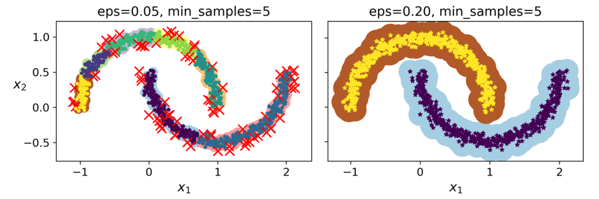
```python
from sklearn.cluster import DBSCAN
import numpy as np

# Generate sample data
X = np.array([[1, 2], [1, 4], [1, 0], [4, 2], [4, 4], [4, 0]])

# Create a DBSCAN object and specify the maximum distance between points (eps) and the minimum number of points to form a core point (min_samples)
dbscan = DBSCAN(eps=1, min_samples=2)

# Fit the DBSCAN model to the data
dbscan.fit(X)

# Obtain the cluster labels for each data point (-1 represents noise/outliers)
labels = dbscan.labels_

# Print the cluster labels
print("Cluster Labels:", labels)

```

# Sieci neuronowe - wprowadzenie

## Perceptron

* Składają się z jednej warstwy neuronów
* Każdy neuron jest jednostką liniową, po której następuje funkcja aktywacji
* Sposób działania:
  * oblicz sumę wejść $z = w_1x_1 + w_2x_2 + ... + w_nx_n = x^Tw$
  * zastosuj funkcję schodkową: $h_w(x) = step(z)$
* Ograniczenia:
  * Nie potrafią rozwiązać pewnych trywialnych problemów, np. XOR. W takich przypadkach stosuje się **sieci wielowarstwowe (MLP)**

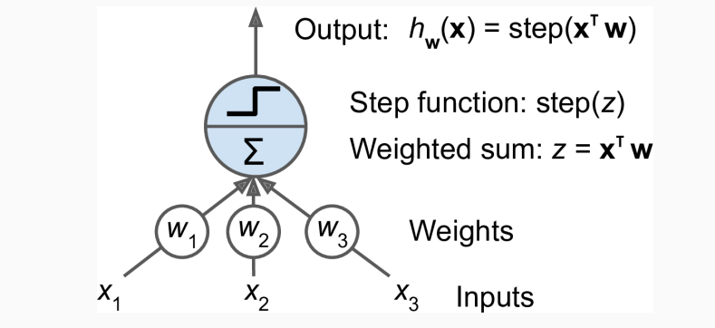


### Uczenie perceptronu

* Uczenie perceptronu polega na znalezieniu wektora wag $w$, który pozwoli na poprawne sklasyfikowanie jak największej liczby instancji
* Wagi są aktualizowane na podstawie błędu predykcji według wzoru $w_{i,j}^{(następna iteracja)} = w_{i,j} + \eta(y_j - \hat{y_j})x_i$
  * $w_{i,j}$ - waga połączenia między neuronem $i$ a neuronem $j$
  * $\eta$ - współczynnik uczenia
  * $y_j$ - wartość oczekiwana
  * $\hat{y_j}$ - wartość przewidziana
  * $x_i$ - wartość wejścia


## Funkcje aktywacji

### Dlaczego potrzebujemy funkcji aktywacji?
* Konieczność nieliniowości
  * Jeżeli używamy liniowych funkcji aktywacji, to kilka nałożonych na siebie warstw jest równoważna z jedną warstwą.
  * Sieć neuronowa będzie zachowywać się jak jedna warstwa neuronów (dla macierzy $W_1$ i $W_2$ będzie można znaleźć macierz $W$, która będzie równoważna działaniu sieci neuronowej, $W = W_2W_1$)
* Potrzebujemy dobrze zdefiniowanej niezerowej pochodnej
  * *Gradient Descent* robi progres w każdym kroku. 

$$ \sigma(z) = \frac{1}{1+e^{-z}} $$

$$ tanh(z) = 2\sigma(2z) - 1 $$

$$ ReLU(z) = max(0, z) $$

$$ LeakyReLU(z) = max(\alpha z, z) $$

$$ ELU(z) = \begin{cases} \alpha (e^z - 1) & \text{if } z < 0 \\ z & \text{if } z \geq 0 \end{cases} $$

$$ SeLU(z) = \begin{cases} \lambda \alpha (e^z - 1) & \text{if } z < 0 \\ \lambda z & \text{if } z \geq 0 \end{cases} $$

$$ Softmax(z)_j = \frac{e^{z_j}}{\sum_{k=1}^K e^{z_k}} $$

Softmax - funkcja aktywacji wykorzystywana w warstwie wyjściowej klasyfikatorów wieloklasowych, generuje rozkład prawdopodobieństwa.

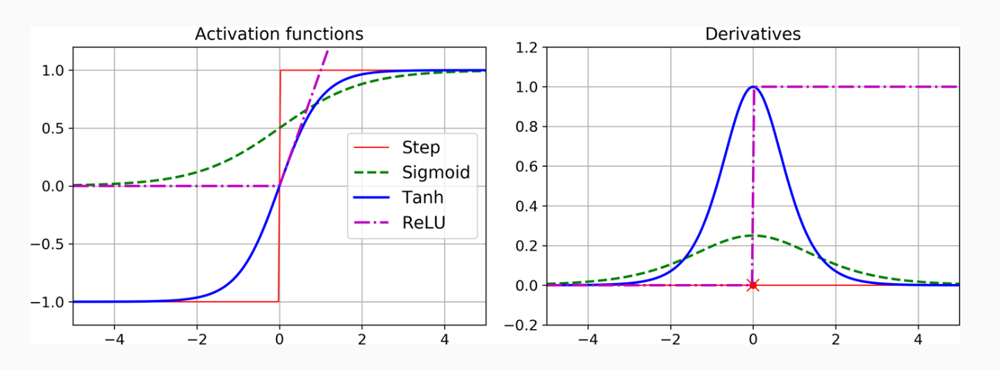

### Którą funkcję aktywacji użyć? 

Wiedza tak trochę ponadprogramowa ale lepiej wiedzieć :>

1. SeLU 
* Najlepsze dla *Głębokiej Sieci Neuronowej* 
* Potrafi się samodzielnie znormalizować
  * Rozwiązuje problem znikających i eksplodujących gradientów.
* Warunki zbioru danych:
  * Wszystkie warstwy muszą być gęste
  * Dane muszą być standaryzowane
    * średnia = 0
    * $\delta$ = 1
  
2. ELU
3. Leaky ReLU
4. ReLU
5. tanh
6. logistic

## Warstwy

### Warstwa gęsta

* Każdy neuron jest połączony z każdym neuronem z poprzedniej warstwy
* Wagi połączeń są zapisane w macierzy wag $W$*
* Każdy neuron ma dodatkowy parametr $b$, który jest nazywany *biasem* - w innym przypadku dla wektora zerowego na wejściu, na wyjściu otrzymalibyśmy wektor zerowy (jeżeli funkcja aktywacji ma punkt stały w 0)

# Głębokie sieci neuronowe

## Budowa modelu

### Keras Sequential API

* Najprostszy sposób tworzenia sieci neuronowej
* Zakłada, że sieć jest sekwencją warstw
* Warstwy dodajemy jako instancje odpowiednich klas z pakietu keras.layers
* parametr można przekazywać jako ciągi znaków. Jest to zapis uproszczony: zamiast ```"relu"``` można przekazać ```keras.activations.relu```
* Normalizację danych można wykonać za pomocą warstwy ```keras.layers.Normalization```, lub ```keras.layers.Flatten```, albo zrobić samemu wcześniej

```python
import tensorflow as tf

model = tf.keras.Sequential([
    tf.keras.layers.Flatten(input_shape=[28, 28]),
    tf.keras.layers.Dense(300, activation="relu"),
    tf.keras.layers.Dense(100, activation="relu"),
    tf.keras.layers.Dense(10, activation="softmax")
])
```

### Keras Functional API

* Pozwala na tworzenie bardziej skomplikowanych architektur sieci neuronowych
* Pozwala na tworzenie grafów obliczeniowych, w których nie wszystkie warstwy są połączone ze sobą w sekwencji
* Pozwala na tworzenie wielu modeli, które mają współdzielone warstwy
* Do tworzenia modelu wykorzystujemy klasę ```tf.keras.Model```, podaje się w niej warstwy wejściowe i wyjściowe
* Do tworzenia warstw wykorzystujemy klasę ```tf.keras.layers```, podobnnie jak w przypadku ```Sequential``` API
* Łączenie warstw odbywa się za pomocą operatora ```(warstwa)(wejście)```, podobnie jak w przypadku wywoływania funkcji, co oznacza, że warstwa jest wywoływana na wejściu otrzymanym z poprzedniej warstwy będącej argumentem wywołania

```python
import tensorflow as tf

input_ = tf.keras.layers.Input(shape=[28, 28])
flatten = tf.keras.layers.Flatten(input_shape=[28, 28])(input_)
hidden1 = tf.keras.layers.Dense(300, activation="relu")(flatten)
hidden2 = tf.keras.layers.Dense(100, activation="relu")(hidden1)
concat = tf.keras.layers.Concatenate()([input_, hidden2])
output = tf.keras.layers.Dense(10, activation="softmax")(concat)
model = tf.keras.Model(inputs=[input_], outputs=[output])
```

## Kompilacja i uczenie modelu

Po utworzeniu modelu należy go skompilować za pomocą metody ```compile()```. Metoda ta przyjmuje następujące parametry: 

* ```optimizer```: Określa **optymalizator** używany do aktualizacji wag modelu podczas procesu uczenia.Optymalizator reguluje sposób, w jaki model aktualizuje wagi na podstawie straty i algorytmu optymalizacji. Ich argumentem jest m.in. ```learning_rate```. Przykładowe optymalizatory:

  * ***SGD*** - Stochastic Gradient Descent
  * ***Momentum*** - SGD z pędem
  * ***Nesterov Accelerated Gradient*** - SGD z pędem Nesterova
    * Szybka zbieżność
    * Minimalnie szybsza od *Momentum*
  * ***AdaGrad*** - Adaptive Gradient, nie wykorzystuje pędu, ale dostosowuje współczynnik uczenia dla każdego parametru na podstawie jego historii aktualizacji
    * Działa dobrze dla prostych problemów kwadratowych
    * Ryzyko nie osiągnięcia minimum
  * ***Adam*** - Adaptive Moment Estimation, wykorzystuje pęd i historię aktualizacji
    * Wariancje  *Adam*:
      * **Nadam**:
        * Adam + Nesterov
        * Generalnie jest lepsza od *Adam*
  * ***RMSProp*** - Zbiera gradienty tylko z najwcześniejszych iteracji
    * Wiele lepszy niż *AdGrad*

## Problemy *Adaptive estimation methods*

* Może źle generalizować zbiory danych
* Jak są jakieś problemy użyj *Nesterov Accelerated Gradient* 

* ```loss```: Określa **funkcję straty**, która jest używana do oceny odchylenia między przewidywaniami modelu a rzeczywistymi wartościami. Przykładowe funkcje straty to 'mean_squared_error', 'categorical_crossentropy', 'binary_crossentropy' itp. Wybór odpowiedniej funkcji straty zależy od rodzaju problemu i rodzaju wyjścia modelu.

* ```metrics```: Określa **metryki**, które będą używane do oceny wydajności modelu. Przykładowe metryki to 'accuracy', 'precision', 'recall', 'mean_absolute_error' itp. Metryki służą do monitorowania wydajności modelu podczas uczenia i ewaluacji.

* Inne opcjonalne argumenty, takie jak loss_weights, sample_weight_mode, weighted_metrics, które pozwalają na bardziej zaawansowane konfigurowanie procesu kompilacji modelu.

```python
model.compile(loss="adam",
              optimizer="sgd",
              metrics=["accuracy"])
```

A następnie wytrenować model za pomocą metody ```fit()```. Metoda ta przyjmuje następujące parametry:

* ```x```: **Dane wejściowe** do modelu.

* ```y```: **Dane wyjściowe** (etykiety) odpowiadające danym wejściowym x.

* ```batch_size```: Określa liczbę próbek, które są przetwarzane jednocześnie przez model w trakcie jednej iteracji.

* ```epochs```: Określa liczbę **epok uczenia** - pełnych przebiegów przez zbiór treningowy. Każda epoka oznacza jedno przejście przez cały zbiór treningowy.
* ```validation_split``` to samo co train_test_split
* ```validation_data```: podajesz dane do testowania, nadpisuje powyższe **Dane walidacyjne** używane do oceny wydajności modelu na każdej epoce. Może to być krotka (x_val, y_val) zawierająca dane wejściowe i oczekiwane wyjście dla danych walidacyjnych.

* ```callbacks```: Lista obiektów zwrotnych (callbacks), które są wywoływane podczas treningu w różnych momentach. Przykłady to ModelCheckpoint, EarlyStopping, TensorBoard itp. Callbacks pozwalają na dostosowywanie zachowania treningu w zależności od określonych warunków.
* ```verbose```: Określa tryb wyświetlania informacji podczas treningu. Może przyjąć wartość 0 (bez wyświetlania), 1 (wyświetlanie paska postępu) lub 2 (wyświetlanie jednej linii na epokę).

* Inne opcjonalne argumenty, takie jak validation_split, shuffle, class_weight itp., które pozwalają na bardziej zaawansowane konfigurowanie procesu treningu modelu.

```python
history = model.fit(
    X_train, 
    y_train, 
    batch_size=32, 
    epochs=10, 
    validation_data=(X_valid, y_valid),
    callbacks=[early_stopping_cb],
    verbose=1
)
```

## Callbacks

* Użyteczne jak mamy długi czas uczenia

Callbacki pozwalają na wykonywanie dodatkowych operacji w trakcie uczenia modelu. Przykładowe zastosowania:

* ```ModelCheckpoint``` - Zapisywanie punktów kontrolnych
* ```EarlyStopping``` - zatrzymanie uczenia, jeżeli nie nastąpi poprawa wyniku przez 10 epok (bardzo częste zastosowanie)
* ```TensorBoard``` - zapisywanie logów do wykorzystania w TensorBoard

```python
checkpoint_cb = keras.callbacks.ModelCheckpoint(
    "my_keras_model.h5",
    save_best_only=True
)
 
early_stopping_cb = keras.callbacks.EarlyStopping(
    patience=10,
    restore_best_weights=True
)

tensorboard_cb = keras.callbacks.TensorBoard(
    log_dir="./my_logs",
    histogram_freq=1,
    profile_batch=100
)
```

Callbacki dodajemy w parametrze ```callbacks``` metody ```fit```

## Analiza procesu uczenia

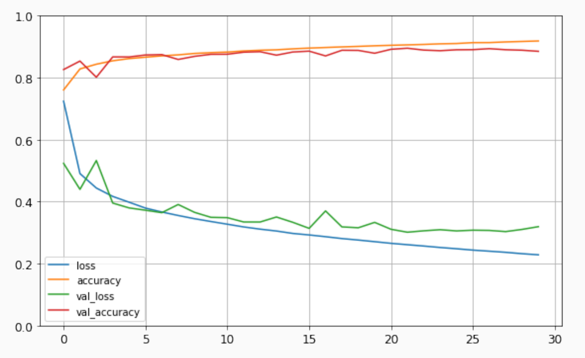

* ***Loss*** - miara, która określa, jak bardzo wyniki modelu różnią się od oczekiwanych wartości.

* ***Accuracy*** - miara, która określa, jak dokładnie model przewiduje klasy lub etykiety dla danych.

* ***Recall*** - miara, która określa, jak wiele pozytywnych przypadków zostało wykrytych przez model.

* ***Precision*** - miara, która określa, jak wiele pozytywnych przypadków zostało poprawnie określonych przez model.

* ***Val_loss*** - strata obliczana na danych walidacyjnych, służy do monitorowania uczenia modelu i unikania przeuczenia.

* ***Val_accuracy*** - dokładność obliczana na danych walidacyjnych, pomaga ocenić, jak dobrze model generalizuje na nowych danych.

Przykłady funkcji strat zostały przedstawione na początku dokumentu.

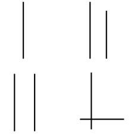{ width=3cm } 

## Przeszukiwanie przestrzeni hiperparametrów

### SciKit-Learn

* ```RandomizedSearchCV``` - losowe przeszukiwanie przestrzeni hiperparametrów
  * Lepsze od GridSearch
* ```GridSearchCV``` - przeszukiwanie przestrzeni hiperparametrów siatką wartości parametrów
  * Wydajny gdy funkcja jest szybka w obliczeniu. (Model mało skomplikowany)
* Jak mamy bardziej złożony model to polecam bibliotekę *Optuna*

### Keras Tuner

* ```RandomSearch``` - losowe przeszukiwanie przestrzeni hiperparametrów


# Konwolucyjne sieci neuronowe (CNN - Convolutional Neural Networks)

* CNN są stosowane do przetwarzania wielowymiarowych danych, takich jak obrazy, wideo itp.
* Wykorzystują specjalny rodzaj warstwy zwanej warstwą konwolucyjną (Convolutional Layer), która wykonuje operację konwolucji na danych wejściowych.
* Wymagają mniejszej liczby parametrów (względem *DNN*).
* Rozbijamy większy problem (np. rozpoznawanie obrazów) na mniejsze prostsze problemy (np. wykrywanie krawędzi).

## Konwolucja

* Struktura Hierarchiczna.
* Zamiast 1 wielkiej warstwy używamy wielu tych samych, małych liniowych warstw w każdej pozycji.
* koncentruje się na niskopoziomowych cechach w początkowych ukrytych warstwach, w kolejnej warstwie agreguje je do większej wysokopoziomowej cechy.
* Konwolucja to operacja matematyczna, która łączy dwa zestawy danych za pomocą funkcji matematycznej, aby wygenerować trzeci zestaw danych.
* W przypadku konwolucyjnych sieci neuronowych operacją konwolucji jest iloczyn skalarny (mnożenie element-wise) dwóch zestawów danych.
* Konwolucja jest operacją liniową, która może być używana do wielu celów, takich jak wykrywanie krawędzi i innych wzorców w obrazach, wykrywanie cech w danych itp.
* Polega na wykonywania sum ważonych dla fragmentów funkcji wejściowej ważonej przez jądro (kernel, który jest macierzą wag).
* W przypadku sieci neuronowych dane wejściowe są zwykle macierzą wielowymiarową (np. obrazem) i są one łączone z macierzą wag (kernel), aby wygenerować macierz wyjściową
* Wagi są parametrami, które są uczone podczas treningu modelu
* W przypadku obrazów macierz wejściowa zawiera piksele obrazu, a macierz wag zawiera filtry, które są aplikowane na obrazie
* Konwolucja może być obliczana na całym obrazie, ale zwykle stosuje się ją tylko do fragmentu obrazu, aby uzyskać macierz wyjściową o takich samych wymiarach jak macierz wejściowa
* W przypadku obrazów wagi są zwykle małymi macierzami o wymiarach 3x3 lub 5x5. W przypadku obrazów kolorowych, które mają 3 kanały kolorów (RGB), macierz wag ma wymiary 3x3x3 lub 5x5x3.
* Każda warstwa konwolucyjna składa się z wielu filtrów, które są stosowane do danych wejściowych, aby wygenerować różne macierze wyjściowe w celu wykrycia różnych cech w danych wejściowych

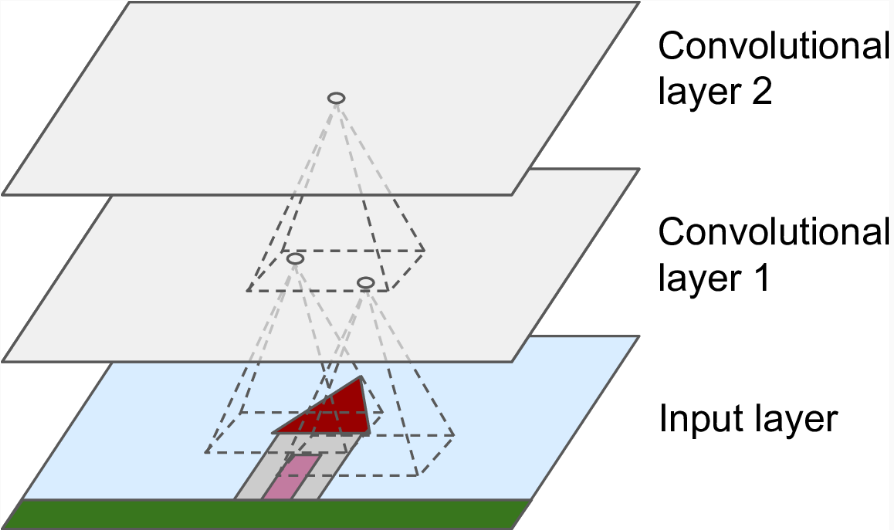

## Typowe błędy podczas projektowania CNN

* Stosowanie za dużych jądr konwolucji (Wyjątek: Pierwsza warstwa konwolucyjna)
  * Zamiast tego nałóż więcej mniejszych warstw
    * Prowadzi to do mniejszej liczby parametrów i mniejszej liczby obliczeń.

## Pooling

* Pooling neuron nie posiada wagi
  * Jej celem jest agregacja wejść korzystając z funkcji *max* lub *mean*.
* Pooling jest operacją, która zmniejsza wymiary danych wejściowych poprzez zastąpienie fragmentu danych wejściowych pojedynczą wartością reprezentującą ten fragment zwracaną przez sprecyzowaną wcześniej funkcję
* Najczęściej stosowaną funkcją agregującą jest funkcja max, która zwraca maksymalną wartość w fragmencie danych wejściowych
* Pozwala kolejnym warstwom sieci na wykrywanie cech bardziej ogólnych, poprzez zwielokrotnienie obszaru, na którym bezpośrednio działają
* Często stosowany po warstwie konwolucyjnej, aby zmniejszyć wymiary danych wejściowych
* Najczęściej zmniejsza każdy wymiar danych wejściowych o połowę.

## Dropout

* Sprawia, że wielka sieć działa jak mniejsza losowo trenując podsekcje sieci.
  * __*Mniejsze sieci neuronowe nie mają skłonności do przeuczenia*__
* Dropout jest techniką regularyzacji, która losowo wyłącza neurony podczas uczenia
* Pomaga w zapobieganiu przeuczeniu modelu.

## Uczenie rezydualne (Residual Learning)

* Residual Learning jest techniką uczenia głębokich sieci neuronowych, która skupia się na uczeniu różnic (residuum) pomiędzy wartością rzeczywistą a przewidywaną
* Residual Learning pomaga w zapobieganiu zanikaniu gradientu (vanishing gradient) i przyspiesza proces uczenia modelu
* Wykorzystujemy obejście (skip connection), aby dodać dane wejściowe do danych wyjściowych warstwy, aby uzyskać dane wyjściowe warstwy rezydualnej.
  * Sieć zaczyna robić progres nawet kiedy niektóre warstwy sieci nie zaczęły procesu uczenia.

## Klasyfikacja i Lokalizacja obiektów

* Lokalizacja obiektów jest techniką uczenia głębokich sieci neuronowych, która służy do wykrywania obiektów w konkretnej lokalizacji na obrazie
* Można wykorzystać sieci w pełni konwolucyjne (Fully Convolutional Networks) do lokalizacji obiektów, wtedy każdy element wyjściowej macierzy reprezentuje prawdopodobieństwo wystąpienia obiektu w określonym obszarze obrazu
* Inną metodą jest wykorzystanie przesuwanego okna (sliding window), która polega na przesuwaniu okna po obrazie i sprawdzaniu, czy w oknie znajduje się obiekt, wymaga to wielokrotnego przetwarzania obrazu, co jest bardzo kosztowne obliczeniowo oraz różnych rozmiarów okna, aby wykryć obiekty o różnych rozmiarach

### Bounding Boxes

* Sieci takie nazywamy *Region Proposal Network*.
* Gdy zaklasyfikujemy pewien obiekt i chcemy go zlokalizować na obrazie stosujemy *Bounding Boxes*- czyli określamy prostokątem fragment obrazu w którym najprawdopodobniej znajduje się obiekt.
* *non-max suppression*
  * Usuwamy nadmierną detekcje tego samego obiektu.


### Fully Convolutional Networks

* Może być przećwiczona i użyta dla obrazów dowolnej wielkości

### YOLO You Only Look Once

* Szybkie i dokładne
* Działa w czasie rzeczywistym

### *Transponowana warstwa konwolucyjna* (*Transposed Convolutional Layer*)

  * Może wykonywać interpolację liniową
  * Warstwa którą możemy trenować
  * Rozciąga zdjęcia przez dodawanie pustych wierszy i kolumn

### Segmentacja semantyczna
  
  * Segmentacja semantyczna jest problemem, który polega na przypisaniu każdemu pikselowi obrazu etykiety, która reprezentuje klasę, do której należy dany piksel
  * Można w tym celu stosować architekturę U-Net, która składa się z warstw konwolucyjnych, warstw poolingowych i warstw dekonwolucyjnych twojącą symetryczną strukturę w kształcie litery U.
  * Różne obiekty tej samej klasy nie są rozróżnialne.

### Metryki:
  
  * *Mean Average Precision*
  * *Intersection over Union*
    * Sprawdza jak dobrze model przewiduje *pola ograniczające* (bounding boxes).

# Rekurencyjne sieci neuronowe (RNN - Recurrent Neural Networks)

* RNN są stosowane do przetwarzania sekwencyjnych danych, takich jak tekst, dźwięk, czasowe serie danych itp.
* Wykonują przewidywania dla sekwencji o dowolnej długości.
* Często wykorzystywane do predykcji na podstawie sekwencji danych wejściowych (o dowolnej długości), najczęściej do przewidywania przyszłości.
* Wykorzystują specjalny rodzaj warstwy zwanej warstwą rekurencyjną (Recurrent Layer), która przechowuje stan wewnętrzny, który jest aktualizowany za każdym razem, gdy warstwa otrzymuje dane wejściowe.
* Sieć wykonuje tą samą operację na każdym elemencie sekwencji, po czym agreguje informacje poprzednich wyrażeń w celu przewidzenia następnego.
* Zastosowania: finanse (giełda), pojazdy autonomiczne, sterowanie, wykrywanie usterek
* __*Dużą wadą są znikające i eksplodujące gradienty*__
  * gradient $\approx$ 0 lub zmieża do $\infty$.
* Gdy sekwencja danych jest bardzo długa, sieć zapomina początkowe wartości

Podstawowym elementem RNN jest komórka rekurencyjna, która ma stan wewnętrzny przechowujący informacje z poprzednich **kroków czasowych (ramek)**. W każdym kroku czasowym komórka otrzymuje dane wejściowe oraz stan wewnętrzny (z poprzedniego kroku) i generuje nowy stan wewnętrzny oraz dane wyjściowe. Ten proces jest powtarzany dla każdego kroku czasowego.

Istnieje kilka różnych typów RNN, takich jak **SimpleRNN**, **LSTM** (Long Short-Term Memory), **GRU** (Gated Recurrent Unit) i **Bidirectional RNN**, które różnią się w sposobie zarządzania i aktualizacji stanu wewnętrznego. Na przykład, LSTM wprowadza bramki, które kontrolują przepływ informacji, pozwalając na efektywne uczenie się zależności na różnych skalach czasowych i unikanie problemu zanikającego gradientu.

## Rodzaje RNN ze względu na rodzaj danych wejściowych/wyjściowych

### Sequence to sequence network

* Pobiera sekwencje danych wejściowych i generuje sekwencję przewidywanych danych.

### Vector to sequence network

* Podaje ten sam wektor danych wejściowych w każdym kroku czasowym i generuje sekwencję przewidywanych danych.
* Dekodera.

### Sequence to vector network

* Podaj sekwencję danych wejściowych i zignoruj wygenerowaną sekwencję przewidywanych danych poza ostatnią wartością.
* Enkoder.

## Działanie RNN w kilku krokach:

* Dane wejściowe sekwencyjne są podzielone na kroki czasowe.
* Na każdym kroku czasowym, dane wejściowe są przetwarzane przez komórkę rekurencyjną, która aktualizuje swój stan wewnętrzny.
* Dane wyjściowe są generowane na podstawie aktualnego stanu wewnętrznego.
* Proces jest powtarzany dla kolejnych kroków czasowych, przekazując informacje z poprzednich kroków.

## Przewidywanie kilku kroków czasowych do przodu

* Rozróżniamy 3 najpopularniejsze sposoby:
  * Model przewiduje 1 krok czasowy na raz
    * Wyjście modelu prowadzimy do wejścia modelu
    * Najgorsza opcja, błąd jest akumulowany za każdym cyklem
  * Model przewiduje $n$ kroków na raz
  * Model przewiduje wszystkie kroki na raz
    * Najlepiej ją stosować

## Unrolling (rozwijanie) 

Proces rozwinięcia lub dekompresji sieci rekurencyjnej na wielu krokach czasowych. W standardowej definicji RNN, model jest reprezentowany jako powtarzające się jednostki, które operują na danych wejściowych w każdym kroku czasowym. Jednak w celu lepszego zrozumienia i wizualizacji działania sieci, często stosuje się unrolling.

Podczas unrollingu, sieć rekurencyjna jest rozwinięta wzdłuż osi czasu, tworząc sekwencję powiązanych ze sobą jednostek. Każda jednostka reprezentuje stan wewnętrzny (np. LSTM lub GRU) oraz warstwę wyjściową, która otrzymuje dane wejściowe z danego kroku czasowego i generuje dane wyjściowe dla tego kroku. Te powiązane jednostki są połączone ze sobą, przechodząc informacje z jednego kroku czasowego do drugiego.

## Osadzenia

* Dokładnie reprezentują ciągi o zmiennej długości przez wektory o stałej długości.

## Rozwiązanie problemu niestabilnych gradientów

* Użyj tych samych rozwiązań co w przypadku *DNN*
* Nie stosuj nienasyconych funkcji aktywacji
  * np. ReLU
* *Batch Normalization* nie jest przydatne
  * Jak już musisz to stosuj pomiędzy warstwami rekurencyjnymi
* *Layer Normalization*


# Zadania egzamin
```
Dla algorytmu K means (k=2) wylicz środku centroidów po 1szej iteracji. Inicjalne środki centroidów to: [0.00, 3.00]. Dane uczące X = [8.00, 1.00, 7.00, 9.00, 3.00, 9.00]. Opisz rozwiązanie krok po kroku

ChatGPT
Aby obliczyć środki centroidów po pierwszej iteracji algorytmu K-means dla k=2, należy przeprowadzić następujące kroki:

Inicjalizacja środków centroidów: W tym przypadku inicjalne środki centroidów wynoszą [0.00, 3.00].

Przypisanie punktów do klastrów: Dla każdego punktu w danych uczących X = [8.00, 1.00, 7.00, 9.00, 3.00, 9.00], obliczamy odległość do obu środków centroidów i przypisujemy punkt do klastra z bliższym środkiem centroida.

Dla punktu 8.00: Odległość do środka centroida 0.00 wynosi 8.00, a odległość do środka centroida 3.00 wynosi 5.00. Punkt zostaje przypisany do klastra o środku centroida 3.00.
Dla punktu 1.00: Odległość do środka centroida 0.00 wynosi 1.00, a odległość do środka centroida 3.00 wynosi 2.00. Punkt zostaje przypisany do klastra o środku centroida 0.00.
Dla punktu 7.00: Odległość do środka centroida 0.00 wynosi 7.00, a odległość do środka centroida 3.00 wynosi 4.00. Punkt zostaje przypisany do klastra o środku centroida 3.00.
Dla punktu 9.00: Odległość do środka centroida 0.00 wynosi 9.00, a odległość do środka centroida 3.00 wynosi 6.00. Punkt zostaje przypisany do klastra o środku centroida 3.00.
Dla punktu 3.00: Odległość do środka centroida 0.00 wynosi 3.00, a odległość do środka centroida 3.00 wynosi 0.00. Punkt zostaje przypisany do klastra o środku centroida 3.00.
Dla punktu 9.00: Odległość do środka centroida 0.00 wynosi 9.00, a odległość do środka centroida 3.00 wynosi 6.00. Punkt zostaje przypisany do klastra o środku centroida 3.00.
Po przypisaniu wszystkich punktów do klastrów, otrzymujemy następujące przyporządkowanie:
Klastry:

Klastr 0: [1.00]
Klastr 3: [8.00, 7.00, 9.00, 3.00, 9.00]
Obliczanie nowych środków centroidów: Dla każdego klastra obliczamy nowy środek centroida, który jest równy średniej


Obliczanie nowych środków centroidów: Dla każdego klastra obliczamy nowy środek centroida, który jest równy średniej wartości wszystkich punktów przypisanych do tego klastra.

Dla klastra 0, mamy tylko jeden punkt o wartości 1.00, więc nowy środek centroida dla tego klastra wynosi 1.00.
Dla klastra 3, mamy pięć punktów o wartościach 8.00, 7.00, 9.00, 3.00 i 9.00. Średnia wartość tych punktów wynosi (8.00 + 7.00 + 9.00 + 3.00 + 9.00) / 5 = 7.20. Więc nowy środek centroida dla tego klastra wynosi 7.20.
Po obliczeniu nowych środków centroidów, otrzymujemy:
Nowe środki centroidów:

[1.00, 7.20]
To jest wynik po pierwszej iteracji algorytmu K-means dla k=2. Możemy teraz kontynuować kolejne iteracje, powtarzając kroki 2 i 3, aby ostatecznie znaleźć stabilne środki centroidów.
```
```
Aby obliczyć liczbę trenowalnych parametrów w każdej z warstw sieci gęstej, musimy wiedzieć, ile wag i biasów jest przypisanych do każdego neuronu w danej warstwie.

Warstwa wejściowa składa się z 8 neuronów. Każdy neuron w warstwie wejściowej jest połączony z każdym neuronem w pierwszej warstwie ukrytej, dlatego liczba wag dla każdego neuronu w pierwszej warstwie ukrytej wynosi 8. Dodatkowo, dla każdego neuronu w pierwszej warstwie ukrytej mamy jeden bias. Stąd liczba parametrów w pierwszej warstwie ukrytej wynosi:

Liczba parametrów w pierwszej warstwie ukrytej = (Liczba neuronów w pierwszej warstwie ukrytej) * (Liczba neuronów w warstwie wejściowej + 1) = 31 * (8 + 1) = 31 * 9 = 279.

Analogicznie możemy obliczyć liczbę parametrów dla pozostałych warstw gęstych:

Liczba parametrów w drugiej warstwie ukrytej = 19 * (31 + 1) = 19 * 32 = 608.

Liczba parametrów w trzeciej warstwie ukrytej = 42 * (19 + 1) = 42 * 20 = 840.

Liczba parametrów w czwartej warstwie ukrytej = 35 * (42 + 1) = 35 * 43 = 1505.

Ostatecznie, łączna liczba parametrów w modelu to suma parametrów we wszystkich warstwach:

Laczna liczba parametrów w modelu = Liczba parametrów w pierwszej warstwie ukrytej + Liczba parametrów w drugiej warstwie ukrytej + Liczba parametrów w trzeciej warstwie ukrytej + Liczba parametrów w czwartej warstwie ukrytej
= 279 + 608 + 840 + 1505
= 3232.

Zatem, liczba trenowalnych parametrów w poszczególnych warstwach sieci gęstej oraz łączna liczba parametrów w modelu wynoszą:

Warstwa gęsta 1: 279 parametrów
Warstwa gęsta 2: 608 parametrów
Warstwa gęsta 3: 840 parametrów
Warstwa gęsta 4: 1505 parametrów
Laczna liczba parametrów w modelu: 3232 parametry.


PS:
W równaniu Liczba parametrów w pierwszej warstwie ukrytej = (Liczba neuronów w pierwszej warstwie ukrytej) * (Liczba neuronów w warstwie wejściowej + 1), +1 jest dodawane, ponieważ dla każdego neuronu w warstwie ukrytej dodajemy dodatkowy bias.

Bias jest wartością stałą dodawaną do sumy ważonych wejść neuronu, zanim zostanie zastosowana funkcja aktywacji. Bias jest reprezentowany przez jeden parametr dla każdego neuronu w warstwie, niezależnie od liczby neuronów w warstwie wejściowej.

W równaniu, gdy mnożymy (Liczba neuronów w warstwie wejściowej + 1) przez (Liczba neuronów w pierwszej warstwie ukrytej), otrzymujemy sumę wag dla wszystkich połączeń między neuronami warstwy wejściowej a warstwą ukrytą, a także sumę wag dla biasów dla każdego neuronu w warstwie ukrytej.

Dodając +1 do (Liczba neuronów w warstwie wejściowej), uwzględniamy bias jako jeden z parametrów w pierwszej warstwie ukrytej.
```
```
Dana jest sieć zawierająca:
- warstwę wejściową o 3 neuronach
- jedną warstwę ukryta o 3 neuronach z funkcją aktywacji ReLU
-warstwę wejściową o 1 neuronie z liniową funkcją aktywacji 
Wagi połączeń warstwy ukrytej opisuje macierz:
w = [[0.36, 0.63, -1.00], [0.10, 0.72. 0.10], [0.65, 0.16, -0.77]]
 Wagi podane są w sposób analogiczny do tego w Keraz tzn poszczególne kolumny odnosza się do kolejnych neuronów warstwy ukrytej a kolejne wartości w wierszach kolumny modelują wagi połączeń danego neuronu warstwy ukrytej z kolejnymi neuronami warstwy wejśiowej, od lewej do prawej strony.

Wagi warsty wejściowej (1 neuron) to:
w_0 = [-0.58, 0.22, 0.59]
Oblicz wyjście z sievi jeżeli na wejście zostanie podany wektor [0.00 0.00 1.00]. Zaprezentuj rozwiązanie krok po kroku

ChatGPT
Aby obliczyć wyjście sieci dla podanego wektora wejściowego [0.00, 0.00, 1.00], wykonajemy następujące kroki:

Oblicz sumę ważoną dla neuronów warstwy ukrytej:
h_1 = (0.00 * 0.36) + (0.00 * 0.10) + (1.00 * 0.65) = 0.65
h_2 = (0.00 * 0.63) + (0.00 * 0.72) + (1.00 * 0.16) = 0.16
h_3 = (0.00 * -1.00) + (0.00 * 0.10) + (1.00 * -0.77) = -0.77

Zastosuj funkcję aktywacji ReLU na wynikach z kroku 1:
a_1 = max(0, h_1) = max(0, 0.65) = 0.65
a_2 = max(0, h_2) = max(0, 0.16) = 0.16
a_3 = max(0, h_3) = max(0, -0.77) = 0 (ReLU zamienia wartość ujemną na zero)

Oblicz sumę ważoną dla neuronu warstwy wyjściowej:
o = (a_1 * -0.58) + (a_2 * 0.22) + (a_3 * 0.59) = (0.65 * -0.58) + (0.16 * 0.22) + (0 * 0.59)
= -0.377 + 0.0352 + 0 = -0.3418

Zwróć wyjście sieci, które jest równoważne wartości neuronu warstwy wyjściowej:
output = o = -0.3418

Dlatego dla podanego wektora wejściowego [0.00, 0.00, 1.00], wyjście sieci wynosi -0.3418.
```
```
Dany jest wektor danych uczących  X = [0.39, 0.12, 0.73, 0.03, 0.69, 0.24] oraz odpowiadający mu wektor wartości y = [0.30, 0.09, 0.96, 0.84, 0.97, 0.08] 
Używając metody najbliższych sąsiadów, dla k=3 policz oczekiwane wartości dla danych [0.21, 0.16].


Metoda najbliższych sąsiadów (k-NN) jest prostym algorytmem klasyfikacji, który używa podobieństwa między punktami danych do przewidywania wartości dla nowych punktów. W przypadku, gdy chcemy przewidzieć wartości, a nie klasyfikować, możemy obliczyć średnią wartości sąsiadów.

W pierwszym kroku musimy obliczyć odległości między punktem, którego chcemy przewidzieć wartość, a wszystkimi punktami w zbiorze uczącym. W tym przypadku, chcemy obliczyć odległość między punktami [0.21, 0.16] a każdym punktem w zbiorze uczącym.

Odległość Euklidesowa między dwoma punktami w dwuwymiarowej przestrzeni jest obliczana jako pierwiastek kwadratowy sumy kwadratów różnic między odpowiadającymi współrzędnymi.

Oto obliczenia dla zbioru uczącego X = [0.39, 0.12, 0.73, 0.03, 0.69, 0.24] i wartości y = [0.30, 0.09, 0.96, 0.84, 0.97, 0.08]:

Dla punktu [0.21, 0.16]:

Odległość między [0.21, 0.16] a [0.39, 0.12] = sqrt((0.39 - 0.21)^2 + (0.12 - 0.16)^2) = sqrt(0.018 + 0.0016) = sqrt(0.0196) = 0.14
Odległość między [0.21, 0.16] a [0.73, 0.03] = sqrt((0.73 - 0.21)^2 + (0.03 - 0.16)^2) = sqrt(0.2304 + 0.0144) = sqrt(0.2448) = 0.49
Odległość między [0.21, 0.16] a [0.03, 0.69] = sqrt((0.03 - 0.21)^2 + (0.69 - 0.16)^2) = sqrt(0.0400 + 0.1936) = sqrt(0.2336) = 0.48
Odległość między [0.21, 0.16] a [0.69, 0.24] = sqrt((0.69 - 0.21)^2 + (0.24 - 0.16)^2) = sqrt(0.2025 + 0.0064) = sqrt(0.2089) = 0.46
Odległość między [0.21, 0.16] a [0.69, 0.24] = sqrt((0.69 - 0.21)^2 + (0.24 - 0.16)^2) = sqrt(0.2025 + 0.0064) = sqrt(0.2089) = 0.46

Teraz mamy odległości między punktem [0.21, 0.16] a każdym punktem w zbiorze uczącym:

0.14, 0.49, 0.48, 0.46
Następnie, musimy wybrać k najbliższych sąsiadów dla punktu [0.21, 0.16]. W tym przypadku, k = 3, więc wybieramy trzy najmniejsze odległości.

Najmniejsze trzy odległości to: 0.14, 0.46, 0.48

Teraz, aby przewidzieć oczekiwaną wartość dla punktu [0.21, 0.16], musimy obliczyć średnią wartości odpowiadających tym trzem najbliższym sąsiadom.

Odpowiednie wartości y dla tych trzech najbliższych sąsiadów to: 0.30, 0.08, 0.96

Oczekiwana wartość dla punktu [0.21, 0.16] jest średnią tych trzech wartości:
(0.30 + 0.08 + 0.96) / 3 = 1.34 / 3 = 0.45

Przy użyciu metody najbliższych sąsiadów dla k = 3, oczekiwana wartość dla punktu [0.21, 0.16] wynosi 0.45.
```

## All algorithms complexity
| Algorithm                 | Memory Complexity             | Time Complexity            | Explanation                                                                                                                     |
|---------------------------|-------------------------------|-----------------------------|---------------------------------------------------------------------------------------------------------------------------------|
| Linear Regression         | O(1)                          | O(n)                        | Linear regression is a simple algorithm that calculates a line that best fits the given data points, making it computationally efficient with a constant memory requirement. |
| Logistic Regression       | O(1)                          | O(n)                        | Logistic regression is similar to linear regression, but with a sigmoid activation function. It has the same memory and time complexities as linear regression.                            |
| Decision Trees            | O(n)                          | O(n * m log(m))             | Decision trees recursively split the data based on features. The memory complexity is proportional to the number of training examples, while time complexity depends on the depth and number of splits. |
| Random Forests            | O(n * m)                      | O(n * m log(m))             | Random forests are an ensemble of decision trees. The memory complexity is higher as it stores multiple trees, but the time complexity remains similar to decision trees.                  |
| Support Vector Machines   | O(n^2)                        | O(n^3)                      | Support Vector Machines (SVMs) construct a hyperplane to separate data points. The memory complexity is quadratic due to the kernel matrix, and the time complexity is cubic.                  |
| K-Nearest Neighbors (KNN) | O(n)                          | O(n log(n))                 | KNN classifies instances based on the majority class of its nearest neighbors. It has a linear memory complexity but a logarithmic time complexity for efficient nearest neighbor search.    |
| Naive Bayes               | O(n)                          | O(n * m)                    | Naive Bayes is a probabilistic classifier. It has linear memory complexity and linear time complexity, where n is the number of training examples and m is the number of features.     |
| Neural Networks           | O(m) - O(m^2)                 | O(k * m * n) - O(k * m^2)  | Neural networks have varying memory complexity depending on the number of parameters (weights and biases). Time complexity depends on the number of layers and the training algorithm used. |
| Gradient Boosting         | O(n)                          | O(n * m * T)                | Gradient Boosting combines weak learners in an iterative manner. Memory complexity is linear, and time complexity depends on the number of training examples, features, and iterations (T).    |

## All algorithms steps
1. Linear Regression:
   - Step 1: Calculate the mean of the input features and the target variable.
   - Step 2: Calculate the covariance between the input features and the target variable.
   - Step 3: Calculate the slope (β1) using the covariance divided by the variance of the input features.
   - Step 4: Calculate the intercept (β0) using the mean of the target variable and the slope.

2. Logistic Regression:
   - Step 1: Initialize the weights and biases.
   - Step 2: Calculate the weighted sum of the input features.
   - Step 3: Apply the sigmoid activation function to obtain the predicted probabilities.

3. Decision Trees:
   - Step 1: Select the best feature to split the data based on a criterion (e.g., information gain or Gini impurity).
   - Step 2: Split the data into two branches based on the selected feature and its threshold value.
   - Step 3: Repeat steps 1 and 2 recursively for each branch until a stopping condition is met.

4. Random Forests:
   - Step 1: Create multiple decision trees using different subsets of the training data (bootstrapping) and random feature subsets.
   - Step 2: For a new input, predict the label using each decision tree and assign the majority vote as the final prediction.

5. Support Vector Machines (SVM):
   - Step 1: Transform the input data using a kernel function (e.g., polynomial or Gaussian).
   - Step 2: Find the hyperplane that maximally separates the transformed data points while minimizing the classification error.

6. K-Nearest Neighbors (KNN):
   - Step 1: Choose the number of neighbors (k).
   - Step 2: Calculate the distance between the input instance and all training instances.
   - Step 3: Select the k nearest neighbors based on the calculated distances.
   - Step 4: Classify the input instance based on the majority class of the selected neighbors.

7. Naive Bayes:
   - Step 1: Calculate the prior probability of each class based on the training data.
   - Step 2: Calculate the conditional probability of each feature given each class.
   - Step 3: For a new instance, calculate the posterior probability of each class using Bayes' theorem.
   - Step 4: Classify the instance based on the class with the highest posterior probability.


## All algorithms when to use
**1. Linear Regression**:
- Description: Linear regression is a simple algorithm used for predicting continuous values based on a linear relationship between input features and the target variable. It calculates a line that best fits the given data points.
- Use Case: Linear regression is suitable when there is a linear relationship between the input features and the target variable. It is often used for tasks such as price prediction, demand forecasting, or trend analysis.
- Example: Suppose you have a dataset with historical housing prices and corresponding features like square footage and number of bedrooms. You can use linear regression to predict the price of a new house based on its square footage and number of bedrooms.

**2. Logistic Regression**:
- Description: Logistic regression is a classification algorithm used for predicting binary or multi-class labels. It models the probability of an instance belonging to a particular class using a logistic function.
- Use Case: Logistic regression is suitable when dealing with binary or multi-class classification problems. It is commonly used in spam detection, disease diagnosis, sentiment analysis, or customer churn prediction.
- Example: Suppose you have a dataset of customer feedback labeled as positive, neutral, or negative. Using logistic regression, you can predict the sentiment of new customer reviews based on their textual content.

**3. Decision Trees**:
- Description: Decision trees are versatile algorithms that recursively split the data based on features to make predictions. Each internal node represents a feature test, and each leaf node represents a predicted label.
- Use Case: Decision trees are suitable for both classification and regression tasks. They are effective in capturing complex relationships and handling both numerical and categorical features. Decision trees are commonly used in credit scoring, customer segmentation, or medical diagnosis.
- Example: Suppose you have a dataset of customer information, including age, income, and buying habits. You can use a decision tree to predict whether a customer will make a purchase based on their characteristics.

**4. Random Forests**:
- Description: Random forests are ensemble models that combine multiple decision trees. Each tree is trained on a different subset of the training data and a random subset of features, and the final prediction is determined by majority voting.
- Use Case: Random forests are suitable when dealing with complex and high-dimensional data. They are effective in reducing overfitting and improving generalization. Random forests are commonly used in image classification, credit risk analysis, or anomaly detection.
- Example: Suppose you have a dataset of credit card transactions labeled as fraudulent or legitimate. You can use a random forest to detect fraudulent transactions based on various transaction features like amount, location, and time.

**5. Support Vector Machines (SVM)**:
- Description: Support Vector Machines construct a hyperplane that maximally separates data points of different classes in a high-dimensional space. SVMs can also handle non-linear decision boundaries using kernel functions.
- Use Case: SVMs are suitable for binary classification tasks with a clear margin of separation between classes. They are effective when dealing with complex and non-linear data. SVMs are commonly used in image recognition, text classification, or bioinformatics.
- Example: Suppose you have a dataset of email messages labeled as spam or non-spam. You can use an SVM to classify new email messages as spam or non-spam based on their content and features like word frequency.

**6. K-Nearest Neighbors (KNN)**:
- Description: K-Nearest Neighbors is a lazy learning algorithm that classifies instances based on the majority class of its k nearest neighbors in the feature space. The distance metric used determines the "closeness" of instances.
- Use Case: KNN is suitable for both classification and regression tasks. It is effective when dealing with locally clustered data and does not assume any underlying distribution. KNN is commonly used in recommendation systems, anomaly detection, or pattern recognition.
- Example: Suppose you have a dataset of online shopping transactions labeled as fraudulent or legitimate. You can use KNN to classify new transactions as fraudulent or legitimate based on their similarity to previously observed transactions.

**7. Naive Bayes**:
- Description: Naive Bayes is a probabilistic classifier based on Bayes' theorem. It assumes that features are conditionally independent given the class labels. Naive Bayes models the joint probability distribution of features and labels.
- Use Case: Naive Bayes is suitable for text classification, document categorization, or spam filtering tasks. It is computationally efficient, requires less training data, and performs well even with high-dimensional feature spaces.
- Example: Suppose you have a dataset of emails labeled as spam or non-spam, and each email is represented by word frequency features. You can use Naive Bayes to classify new emails as spam or non-spam based on the occurrence of words in the email.

These are general descriptions and use cases for each algorithm. It's important to consider the specific characteristics of your problem, the nature of your data, and perform experimentation and evaluation to determine the best algorithm for your specific scenario.
